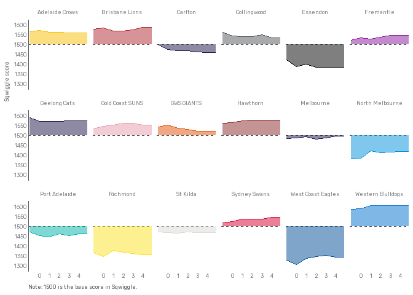

<!-- README.md is generated from README.Rmd. Please edit that file -->

# Sqwiggle

## Introduction

<!-- badges: start -->

<!-- badges: end -->

Sqwiggle is a simple
[ELO](https://cran.r-project.org/web/packages/fitzRoy/vignettes/elo-ratings-example.html)
model for predicting [AFLW](https://www.afl.com.au/aflw) results built
in R using the
[fitzRoy](https://cran.r-project.org/web/packages/fitzRoy/index.html)
and [elo](https://cran.r-project.org/web/packages/elo/index.html)
packages. The name is derived from [Squiggle](https://squiggle.com.au/).

## A better ladder

A key motivation for Sqwiggle was to better understand the state of play
in the AFLW, which is an uneven competition with a compromised fixture.

- As the eighteen teams in the AFLW only play 12 games, whether a team
  is drawn against stronger or weaker opponents will be critical in
  determining the final ladder.

- Similarly, whether the current ladder is reflective of the likely
  finishing positions will depend on whether a team’s draw to date has
  been stronger/weaker than its overall fixture.

We can see this reflected in the table below, which shows data from the
current ladder and a predicted end-of-season ladder based on Sqwiggle.
While both ladders have North Melbourne sitting on top undefeated, other
teams shift position.

\- GWS, who sit 16th are predicted by Sqwiggle to win 0 of their
remaining games and finish 17th.

\- Hawthorn, who sit 2nd and are predicted to hold that position benefit
from upsetting Brisbane in the opening round and a weaker draw
(opposition strength of 1501.7702033) as Sqwiggle only ranks them as the
5th best team.

\- Port Adelaide are predicted to finish 10th even though Sqwiggle ranks
them as the 7th best team as they have the toughest draw (opposition
strength of 1507.7842089).

<table class="table" style="color: black; margin-left: auto; margin-right: auto;">

<thead>

<tr>

<th style="text-align:left;">

Team name
</th>

<th style="text-align:right;">

Wins current
</th>

<th style="text-align:right;">

Wins predicted
</th>

<th style="text-align:right;">

Position current
</th>

<th style="text-align:right;">

Position predicted
</th>

<th style="text-align:right;">

Position model
</th>

<th style="text-align:right;">

Position change
</th>

<th style="text-align:right;">

Opposition strength
</th>

<th style="text-align:left;">

Roo test
</th>

</tr>

</thead>

<tbody>

<tr>

<td style="text-align:left;background-color: rgba(136, 219, 223, 255) !important;">

North Melbourne
</td>

<td style="text-align:right;background-color: rgba(136, 219, 223, 255) !important;">

11
</td>

<td style="text-align:right;background-color: rgba(136, 219, 223, 255) !important;">

12
</td>

<td style="text-align:right;background-color: rgba(136, 219, 223, 255) !important;">

1
</td>

<td style="text-align:right;background-color: rgba(136, 219, 223, 255) !important;">

1
</td>

<td style="text-align:right;background-color: rgba(136, 219, 223, 255) !important;">

1
</td>

<td style="text-align:right;background-color: rgba(136, 219, 223, 255) !important;">

0
</td>

<td style="text-align:right;background-color: rgba(136, 219, 223, 255) !important;">

1502.599
</td>

<td style="text-align:left;background-color: rgba(136, 219, 223, 255) !important;">

FALSE
</td>

</tr>

<tr>

<td style="text-align:left;background-color: rgba(136, 219, 223, 255) !important;">

Melbourne
</td>

<td style="text-align:right;background-color: rgba(136, 219, 223, 255) !important;">

8
</td>

<td style="text-align:right;background-color: rgba(136, 219, 223, 255) !important;">

9
</td>

<td style="text-align:right;background-color: rgba(136, 219, 223, 255) !important;">

3
</td>

<td style="text-align:right;background-color: rgba(136, 219, 223, 255) !important;">

2
</td>

<td style="text-align:right;background-color: rgba(136, 219, 223, 255) !important;">

3
</td>

<td style="text-align:right;background-color: rgba(136, 219, 223, 255) !important;">

1
</td>

<td style="text-align:right;background-color: rgba(136, 219, 223, 255) !important;">

1486.310
</td>

<td style="text-align:left;background-color: rgba(136, 219, 223, 255) !important;">

FALSE
</td>

</tr>

<tr>

<td style="text-align:left;background-color: rgba(136, 219, 223, 255) !important;">

Brisbane Lions
</td>

<td style="text-align:right;background-color: rgba(136, 219, 223, 255) !important;">

8
</td>

<td style="text-align:right;background-color: rgba(136, 219, 223, 255) !important;">

9
</td>

<td style="text-align:right;background-color: rgba(136, 219, 223, 255) !important;">

4
</td>

<td style="text-align:right;background-color: rgba(136, 219, 223, 255) !important;">

3
</td>

<td style="text-align:right;background-color: rgba(136, 219, 223, 255) !important;">

2
</td>

<td style="text-align:right;background-color: rgba(136, 219, 223, 255) !important;">

1
</td>

<td style="text-align:right;background-color: rgba(136, 219, 223, 255) !important;">

1500.580
</td>

<td style="text-align:left;background-color: rgba(136, 219, 223, 255) !important;">

TRUE
</td>

</tr>

<tr>

<td style="text-align:left;background-color: rgba(136, 219, 223, 255) !important;">

Hawthorn
</td>

<td style="text-align:right;background-color: rgba(136, 219, 223, 255) !important;">

9
</td>

<td style="text-align:right;background-color: rgba(136, 219, 223, 255) !important;">

9
</td>

<td style="text-align:right;background-color: rgba(136, 219, 223, 255) !important;">

2
</td>

<td style="text-align:right;background-color: rgba(136, 219, 223, 255) !important;">

4
</td>

<td style="text-align:right;background-color: rgba(136, 219, 223, 255) !important;">

5
</td>

<td style="text-align:right;background-color: rgba(136, 219, 223, 255) !important;">

-2
</td>

<td style="text-align:right;background-color: rgba(136, 219, 223, 255) !important;">

1501.770
</td>

<td style="text-align:left;background-color: rgba(136, 219, 223, 255) !important;">

TRUE
</td>

</tr>

<tr>

<td style="text-align:left;background-color: rgba(136, 219, 223, 255) !important;">

St Kilda
</td>

<td style="text-align:right;background-color: rgba(136, 219, 223, 255) !important;">

7
</td>

<td style="text-align:right;background-color: rgba(136, 219, 223, 255) !important;">

8
</td>

<td style="text-align:right;background-color: rgba(136, 219, 223, 255) !important;">

6
</td>

<td style="text-align:right;background-color: rgba(136, 219, 223, 255) !important;">

5
</td>

<td style="text-align:right;background-color: rgba(136, 219, 223, 255) !important;">

9
</td>

<td style="text-align:right;background-color: rgba(136, 219, 223, 255) !important;">

1
</td>

<td style="text-align:right;background-color: rgba(136, 219, 223, 255) !important;">

1503.919
</td>

<td style="text-align:left;background-color: rgba(136, 219, 223, 255) !important;">

TRUE
</td>

</tr>

<tr>

<td style="text-align:left;background-color: rgba(136, 219, 223, 255) !important;">

West Coast Eagles
</td>

<td style="text-align:right;background-color: rgba(136, 219, 223, 255) !important;">

6
</td>

<td style="text-align:right;background-color: rgba(136, 219, 223, 255) !important;">

7
</td>

<td style="text-align:right;background-color: rgba(136, 219, 223, 255) !important;">

7
</td>

<td style="text-align:right;background-color: rgba(136, 219, 223, 255) !important;">

6
</td>

<td style="text-align:right;background-color: rgba(136, 219, 223, 255) !important;">

13
</td>

<td style="text-align:right;background-color: rgba(136, 219, 223, 255) !important;">

1
</td>

<td style="text-align:right;background-color: rgba(136, 219, 223, 255) !important;">

1492.716
</td>

<td style="text-align:left;background-color: rgba(136, 219, 223, 255) !important;">

FALSE
</td>

</tr>

<tr>

<td style="text-align:left;background-color: rgba(136, 219, 223, 255) !important;">

Adelaide Crows
</td>

<td style="text-align:right;background-color: rgba(136, 219, 223, 255) !important;">

6
</td>

<td style="text-align:right;background-color: rgba(136, 219, 223, 255) !important;">

7
</td>

<td style="text-align:right;background-color: rgba(136, 219, 223, 255) !important;">

8
</td>

<td style="text-align:right;background-color: rgba(136, 219, 223, 255) !important;">

7
</td>

<td style="text-align:right;background-color: rgba(136, 219, 223, 255) !important;">

4
</td>

<td style="text-align:right;background-color: rgba(136, 219, 223, 255) !important;">

1
</td>

<td style="text-align:right;background-color: rgba(136, 219, 223, 255) !important;">

1503.253
</td>

<td style="text-align:left;background-color: rgba(136, 219, 223, 255) !important;">

TRUE
</td>

</tr>

<tr>

<td style="text-align:left;background-color: rgba(136, 219, 223, 255) !important;">

Carlton
</td>

<td style="text-align:right;background-color: rgba(136, 219, 223, 255) !important;">

7
</td>

<td style="text-align:right;background-color: rgba(136, 219, 223, 255) !important;">

7
</td>

<td style="text-align:right;background-color: rgba(136, 219, 223, 255) !important;">

5
</td>

<td style="text-align:right;background-color: rgba(136, 219, 223, 255) !important;">

8
</td>

<td style="text-align:right;background-color: rgba(136, 219, 223, 255) !important;">

12
</td>

<td style="text-align:right;background-color: rgba(136, 219, 223, 255) !important;">

-3
</td>

<td style="text-align:right;background-color: rgba(136, 219, 223, 255) !important;">

1498.429
</td>

<td style="text-align:left;background-color: rgba(136, 219, 223, 255) !important;">

TRUE
</td>

</tr>

<tr>

<td style="text-align:left;background-color: rgba(255, 255, 255, 255) !important;">

Sydney Swans
</td>

<td style="text-align:right;background-color: rgba(255, 255, 255, 255) !important;">

6
</td>

<td style="text-align:right;background-color: rgba(255, 255, 255, 255) !important;">

7
</td>

<td style="text-align:right;background-color: rgba(255, 255, 255, 255) !important;">

9
</td>

<td style="text-align:right;background-color: rgba(255, 255, 255, 255) !important;">

9
</td>

<td style="text-align:right;background-color: rgba(255, 255, 255, 255) !important;">

10
</td>

<td style="text-align:right;background-color: rgba(255, 255, 255, 255) !important;">

0
</td>

<td style="text-align:right;background-color: rgba(255, 255, 255, 255) !important;">

1503.004
</td>

<td style="text-align:left;background-color: rgba(255, 255, 255, 255) !important;">

TRUE
</td>

</tr>

<tr>

<td style="text-align:left;background-color: rgba(255, 255, 255, 255) !important;">

Port Adelaide
</td>

<td style="text-align:right;background-color: rgba(255, 255, 255, 255) !important;">

5
</td>

<td style="text-align:right;background-color: rgba(255, 255, 255, 255) !important;">

6
</td>

<td style="text-align:right;background-color: rgba(255, 255, 255, 255) !important;">

11
</td>

<td style="text-align:right;background-color: rgba(255, 255, 255, 255) !important;">

10
</td>

<td style="text-align:right;background-color: rgba(255, 255, 255, 255) !important;">

7
</td>

<td style="text-align:right;background-color: rgba(255, 255, 255, 255) !important;">

1
</td>

<td style="text-align:right;background-color: rgba(255, 255, 255, 255) !important;">

1507.784
</td>

<td style="text-align:left;background-color: rgba(255, 255, 255, 255) !important;">

TRUE
</td>

</tr>

<tr>

<td style="text-align:left;background-color: rgba(255, 255, 255, 255) !important;">

Fremantle
</td>

<td style="text-align:right;background-color: rgba(255, 255, 255, 255) !important;">

6
</td>

<td style="text-align:right;background-color: rgba(255, 255, 255, 255) !important;">

6
</td>

<td style="text-align:right;background-color: rgba(255, 255, 255, 255) !important;">

10
</td>

<td style="text-align:right;background-color: rgba(255, 255, 255, 255) !important;">

11
</td>

<td style="text-align:right;background-color: rgba(255, 255, 255, 255) !important;">

8
</td>

<td style="text-align:right;background-color: rgba(255, 255, 255, 255) !important;">

-1
</td>

<td style="text-align:right;background-color: rgba(255, 255, 255, 255) !important;">

1510.418
</td>

<td style="text-align:left;background-color: rgba(255, 255, 255, 255) !important;">

TRUE
</td>

</tr>

<tr>

<td style="text-align:left;background-color: rgba(255, 255, 255, 255) !important;">

Geelong Cats
</td>

<td style="text-align:right;background-color: rgba(255, 255, 255, 255) !important;">

5
</td>

<td style="text-align:right;background-color: rgba(255, 255, 255, 255) !important;">

5
</td>

<td style="text-align:right;background-color: rgba(255, 255, 255, 255) !important;">

12
</td>

<td style="text-align:right;background-color: rgba(255, 255, 255, 255) !important;">

12
</td>

<td style="text-align:right;background-color: rgba(255, 255, 255, 255) !important;">

6
</td>

<td style="text-align:right;background-color: rgba(255, 255, 255, 255) !important;">

0
</td>

<td style="text-align:right;background-color: rgba(255, 255, 255, 255) !important;">

1509.245
</td>

<td style="text-align:left;background-color: rgba(255, 255, 255, 255) !important;">

TRUE
</td>

</tr>

<tr>

<td style="text-align:left;background-color: rgba(255, 255, 255, 255) !important;">

Western Bulldogs
</td>

<td style="text-align:right;background-color: rgba(255, 255, 255, 255) !important;">

4
</td>

<td style="text-align:right;background-color: rgba(255, 255, 255, 255) !important;">

4
</td>

<td style="text-align:right;background-color: rgba(255, 255, 255, 255) !important;">

13
</td>

<td style="text-align:right;background-color: rgba(255, 255, 255, 255) !important;">

13
</td>

<td style="text-align:right;background-color: rgba(255, 255, 255, 255) !important;">

11
</td>

<td style="text-align:right;background-color: rgba(255, 255, 255, 255) !important;">

0
</td>

<td style="text-align:right;background-color: rgba(255, 255, 255, 255) !important;">

1491.549
</td>

<td style="text-align:left;background-color: rgba(255, 255, 255, 255) !important;">

FALSE
</td>

</tr>

<tr>

<td style="text-align:left;background-color: rgba(255, 255, 255, 255) !important;">

Richmond
</td>

<td style="text-align:right;background-color: rgba(255, 255, 255, 255) !important;">

2
</td>

<td style="text-align:right;background-color: rgba(255, 255, 255, 255) !important;">

3
</td>

<td style="text-align:right;background-color: rgba(255, 255, 255, 255) !important;">

17
</td>

<td style="text-align:right;background-color: rgba(255, 255, 255, 255) !important;">

14
</td>

<td style="text-align:right;background-color: rgba(255, 255, 255, 255) !important;">

14
</td>

<td style="text-align:right;background-color: rgba(255, 255, 255, 255) !important;">

3
</td>

<td style="text-align:right;background-color: rgba(255, 255, 255, 255) !important;">

1505.015
</td>

<td style="text-align:left;background-color: rgba(255, 255, 255, 255) !important;">

TRUE
</td>

</tr>

<tr>

<td style="text-align:left;background-color: rgba(255, 255, 255, 255) !important;">

Collingwood
</td>

<td style="text-align:right;background-color: rgba(255, 255, 255, 255) !important;">

3
</td>

<td style="text-align:right;background-color: rgba(255, 255, 255, 255) !important;">

3
</td>

<td style="text-align:right;background-color: rgba(255, 255, 255, 255) !important;">

14
</td>

<td style="text-align:right;background-color: rgba(255, 255, 255, 255) !important;">

15
</td>

<td style="text-align:right;background-color: rgba(255, 255, 255, 255) !important;">

16
</td>

<td style="text-align:right;background-color: rgba(255, 255, 255, 255) !important;">

-1
</td>

<td style="text-align:right;background-color: rgba(255, 255, 255, 255) !important;">

1497.248
</td>

<td style="text-align:left;background-color: rgba(255, 255, 255, 255) !important;">

TRUE
</td>

</tr>

<tr>

<td style="text-align:left;background-color: rgba(255, 255, 255, 255) !important;">

Essendon
</td>

<td style="text-align:right;background-color: rgba(255, 255, 255, 255) !important;">

3
</td>

<td style="text-align:right;background-color: rgba(255, 255, 255, 255) !important;">

3
</td>

<td style="text-align:right;background-color: rgba(255, 255, 255, 255) !important;">

15
</td>

<td style="text-align:right;background-color: rgba(255, 255, 255, 255) !important;">

16
</td>

<td style="text-align:right;background-color: rgba(255, 255, 255, 255) !important;">

15
</td>

<td style="text-align:right;background-color: rgba(255, 255, 255, 255) !important;">

-1
</td>

<td style="text-align:right;background-color: rgba(255, 255, 255, 255) !important;">

1506.600
</td>

<td style="text-align:left;background-color: rgba(255, 255, 255, 255) !important;">

TRUE
</td>

</tr>

<tr>

<td style="text-align:left;background-color: rgba(255, 255, 255, 255) !important;">

GWS GIANTS
</td>

<td style="text-align:right;background-color: rgba(255, 255, 255, 255) !important;">

2
</td>

<td style="text-align:right;background-color: rgba(255, 255, 255, 255) !important;">

2
</td>

<td style="text-align:right;background-color: rgba(255, 255, 255, 255) !important;">

16
</td>

<td style="text-align:right;background-color: rgba(255, 255, 255, 255) !important;">

17
</td>

<td style="text-align:right;background-color: rgba(255, 255, 255, 255) !important;">

17
</td>

<td style="text-align:right;background-color: rgba(255, 255, 255, 255) !important;">

-1
</td>

<td style="text-align:right;background-color: rgba(255, 255, 255, 255) !important;">

1487.244
</td>

<td style="text-align:left;background-color: rgba(255, 255, 255, 255) !important;">

FALSE
</td>

</tr>

<tr>

<td style="text-align:left;background-color: rgba(255, 255, 255, 255) !important;">

Gold Coast SUNS
</td>

<td style="text-align:right;background-color: rgba(255, 255, 255, 255) !important;">

1
</td>

<td style="text-align:right;background-color: rgba(255, 255, 255, 255) !important;">

1
</td>

<td style="text-align:right;background-color: rgba(255, 255, 255, 255) !important;">

18
</td>

<td style="text-align:right;background-color: rgba(255, 255, 255, 255) !important;">

18
</td>

<td style="text-align:right;background-color: rgba(255, 255, 255, 255) !important;">

18
</td>

<td style="text-align:right;background-color: rgba(255, 255, 255, 255) !important;">

0
</td>

<td style="text-align:right;background-color: rgba(255, 255, 255, 255) !important;">

1492.317
</td>

<td style="text-align:left;background-color: rgba(255, 255, 255, 255) !important;">

FALSE
</td>

</tr>

</tbody>

</table>

\*Roo test denotes a team plays North Melbourne - the highest ranked
team and prediced to be undefeated. Notably, Hawthorn has the second
lowest opposition strength score despite playing North Melbourne.

## Team strength

As an ELO model, Sqwiggle’s assessment of teams and predictive ability
is based on past performance. Sqwiggle learns as each round is played.
Sqwiggle was also updated after round 4 to account for distance
travelled when calculating home ground advantage. All data below is
derived from this new model.

Sqwiggle’s estimate of each team’s ELO score after each round is shown
below (round zero denotes the team’s end of 2024 score).

## How well does Sqwiggle go at tipping

Sqwiggle’s tipping performance for 2025 is summarised below. As of round
11 it would be leading [The Age’s expert tips
competition](https://www.theage.com.au/sport/afl/aflw-expert-tips-20250814-p5mn1s.html)
and would be top ten in [ESPN’s footy tips
competition](https://www.footytips.com.au/competitions/aflw/ladders?view=ladderScores&season=747&competitionId=706852)

<table class="table" style="color: black; margin-left: auto; margin-right: auto;">

<thead>

<tr>

<th style="text-align:right;">

Number
</th>

<th style="text-align:right;">

Correct
</th>

<th style="text-align:right;">

Games
</th>

<th style="text-align:right;">

Cumulative
</th>

</tr>

</thead>

<tbody>

<tr>

<td style="text-align:right;">

1
</td>

<td style="text-align:right;">

5
</td>

<td style="text-align:right;">

9
</td>

<td style="text-align:right;">

5
</td>

</tr>

<tr>

<td style="text-align:right;">

2
</td>

<td style="text-align:right;">

7
</td>

<td style="text-align:right;">

9
</td>

<td style="text-align:right;">

12
</td>

</tr>

<tr>

<td style="text-align:right;">

3
</td>

<td style="text-align:right;">

6
</td>

<td style="text-align:right;">

9
</td>

<td style="text-align:right;">

18
</td>

</tr>

<tr>

<td style="text-align:right;">

4
</td>

<td style="text-align:right;">

7
</td>

<td style="text-align:right;">

9
</td>

<td style="text-align:right;">

25
</td>

</tr>

<tr>

<td style="text-align:right;">

5
</td>

<td style="text-align:right;">

5
</td>

<td style="text-align:right;">

9
</td>

<td style="text-align:right;">

30
</td>

</tr>

<tr>

<td style="text-align:right;">

6
</td>

<td style="text-align:right;">

8
</td>

<td style="text-align:right;">

9
</td>

<td style="text-align:right;">

38
</td>

</tr>

<tr>

<td style="text-align:right;">

7
</td>

<td style="text-align:right;">

7
</td>

<td style="text-align:right;">

9
</td>

<td style="text-align:right;">

45
</td>

</tr>

<tr>

<td style="text-align:right;">

8
</td>

<td style="text-align:right;">

7
</td>

<td style="text-align:right;">

9
</td>

<td style="text-align:right;">

52
</td>

</tr>

<tr>

<td style="text-align:right;">

9
</td>

<td style="text-align:right;">

7
</td>

<td style="text-align:right;">

9
</td>

<td style="text-align:right;">

59
</td>

</tr>

<tr>

<td style="text-align:right;">

10
</td>

<td style="text-align:right;">

8
</td>

<td style="text-align:right;">

9
</td>

<td style="text-align:right;">

67
</td>

</tr>

<tr>

<td style="text-align:right;">

11
</td>

<td style="text-align:right;">

8
</td>

<td style="text-align:right;">

9
</td>

<td style="text-align:right;">

75
</td>

</tr>

</tbody>

</table>

Sqwiggles tips for the next round are below.

<table class="table" style="color: black; margin-left: auto; margin-right: auto;">

<thead>

<tr>

<th style="text-align:right;">

Round
</th>

<th style="text-align:left;">

Home team
</th>

<th style="text-align:left;">

Away team
</th>

<th style="text-align:right;">

Prediction
</th>

<th style="text-align:right;">

Home game advantage
</th>

<th style="text-align:right;">

Margin predicted
</th>

<th style="text-align:left;">

Tip
</th>

</tr>

</thead>

<tbody>

<tr>

<td style="text-align:right;">

12
</td>

<td style="text-align:left;">

Hawthorn
</td>

<td style="text-align:left;">

North Melbourne
</td>

<td style="text-align:right;">

0.3410082
</td>

<td style="text-align:right;">

0
</td>

<td style="text-align:right;">

-16
</td>

<td style="text-align:left;">

North Melbourne
</td>

</tr>

<tr>

<td style="text-align:right;">

12
</td>

<td style="text-align:left;">

West Coast Eagles
</td>

<td style="text-align:left;">

Carlton
</td>

<td style="text-align:right;">

0.4998753
</td>

<td style="text-align:right;">

5
</td>

<td style="text-align:right;">

5
</td>

<td style="text-align:left;">

West Coast Eagles
</td>

</tr>

<tr>

<td style="text-align:right;">

12
</td>

<td style="text-align:left;">

GWS GIANTS
</td>

<td style="text-align:left;">

Port Adelaide
</td>

<td style="text-align:right;">

0.4099236
</td>

<td style="text-align:right;">

4
</td>

<td style="text-align:right;">

-5
</td>

<td style="text-align:left;">

Port Adelaide
</td>

</tr>

<tr>

<td style="text-align:right;">

12
</td>

<td style="text-align:left;">

Richmond
</td>

<td style="text-align:left;">

Gold Coast SUNS
</td>

<td style="text-align:right;">

0.6017595
</td>

<td style="text-align:right;">

4
</td>

<td style="text-align:right;">

14
</td>

<td style="text-align:left;">

Richmond
</td>

</tr>

<tr>

<td style="text-align:right;">

12
</td>

<td style="text-align:left;">

Sydney Swans
</td>

<td style="text-align:left;">

Essendon
</td>

<td style="text-align:right;">

0.5397431
</td>

<td style="text-align:right;">

2
</td>

<td style="text-align:right;">

6
</td>

<td style="text-align:left;">

Sydney Swans
</td>

</tr>

<tr>

<td style="text-align:right;">

12
</td>

<td style="text-align:left;">

Geelong Cats
</td>

<td style="text-align:left;">

Melbourne
</td>

<td style="text-align:right;">

0.4312177
</td>

<td style="text-align:right;">

0
</td>

<td style="text-align:right;">

-7
</td>

<td style="text-align:left;">

Melbourne
</td>

</tr>

<tr>

<td style="text-align:right;">

12
</td>

<td style="text-align:left;">

Collingwood
</td>

<td style="text-align:left;">

Brisbane Lions
</td>

<td style="text-align:right;">

0.3374061
</td>

<td style="text-align:right;">

4
</td>

<td style="text-align:right;">

-12
</td>

<td style="text-align:left;">

Brisbane Lions
</td>

</tr>

<tr>

<td style="text-align:right;">

12
</td>

<td style="text-align:left;">

St Kilda
</td>

<td style="text-align:left;">

Western Bulldogs
</td>

<td style="text-align:right;">

0.5081591
</td>

<td style="text-align:right;">

0
</td>

<td style="text-align:right;">

1
</td>

<td style="text-align:left;">

St Kilda
</td>

</tr>

<tr>

<td style="text-align:right;">

12
</td>

<td style="text-align:left;">

Adelaide Crows
</td>

<td style="text-align:left;">

Fremantle
</td>

<td style="text-align:right;">

0.5617625
</td>

<td style="text-align:right;">

5
</td>

<td style="text-align:right;">

11
</td>

<td style="text-align:left;">

Adelaide Crows
</td>

</tr>

</tbody>

</table>
