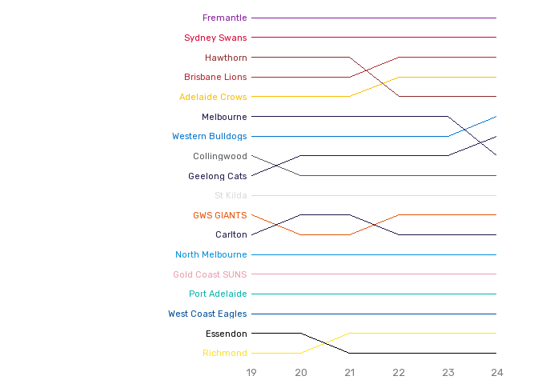
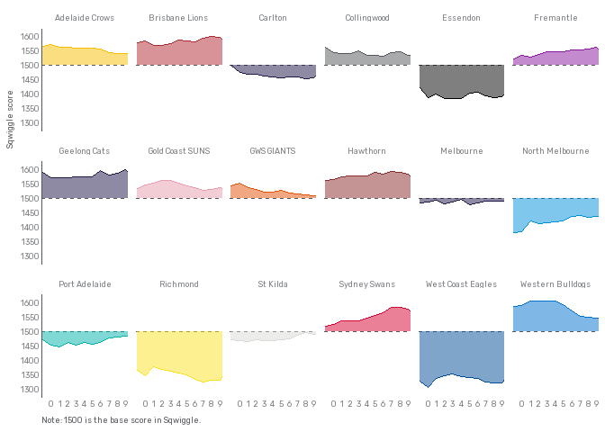
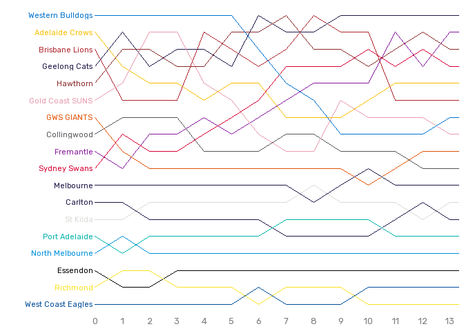

<!-- README.md is generated from README.Rmd. Please edit that file -->

# Sqwiggle

## Introduction

<!-- badges: start -->

<!-- badges: end -->

Sqwiggle is a simple
[ELO](https://cran.r-project.org/web/packages/fitzRoy/vignettes/elo-ratings-example.html)
model for predicting [AFLW](https://www.afl.com.au/aflw) and
[AFLM](https://www.afl.com.au)results built in R using the
[fitzRoy](https://cran.r-project.org/web/packages/fitzRoy/index.html)
and [elo](https://cran.r-project.org/web/packages/elo/index.html)
packages. The name is derived from [Squiggle](https://squiggle.com.au/).

## A better ladder

A key motivation for Sqwiggle was to better understand the state of play
in the AFLW, which is an uneven competition with a compromised fixture.

Sqwiggle’s tipping performance for AFLW 2025 was admirable. Sqwiggle
would have won [The Age’s expert tips
competition](https://www.theage.com.au/sport/afl/aflw-expert-tips-20250814-p5mn1s.html)
and finished top ten in [ESPN’s footy tips
competition](https://www.footytips.com.au/competitions/aflw/ladders?view=ladderScores&season=747&competitionId=706852).

For 2026, I have rebuilt sqwiggle to predict AFLM results. The predicted
ladder after round 18 is below.

<table class="table" style="color: black; margin-left: auto; margin-right: auto;">

<thead>

<tr>

<th style="text-align:left;">

Team name
</th>

<th style="text-align:right;">

Wins current
</th>

<th style="text-align:right;">

Wins predicted
</th>

<th style="text-align:right;">

Position current
</th>

<th style="text-align:right;">

Position predicted
</th>

<th style="text-align:right;">

Position model
</th>

<th style="text-align:right;">

Position change
</th>

<th style="text-align:right;">

Opponents to date
</th>

<th style="text-align:right;">

Opposition strength
</th>

</tr>

</thead>

<tbody>

<tr>

<td style="text-align:left;background-color: rgba(136, 219, 223, 255) !important;">

Fremantle
</td>

<td style="text-align:right;background-color: rgba(136, 219, 223, 255) !important;">

15
</td>

<td style="text-align:right;background-color: rgba(136, 219, 223, 255) !important;">

20
</td>

<td style="text-align:right;background-color: rgba(136, 219, 223, 255) !important;">

1
</td>

<td style="text-align:right;background-color: rgba(136, 219, 223, 255) !important;">

1
</td>

<td style="text-align:right;background-color: rgba(136, 219, 223, 255) !important;">

2
</td>

<td style="text-align:right;background-color: rgba(136, 219, 223, 255) !important;">

0
</td>

<td style="text-align:right;background-color: rgba(136, 219, 223, 255) !important;">

10
</td>

<td style="text-align:right;background-color: rgba(136, 219, 223, 255) !important;">

-3.057
</td>

</tr>

<tr>

<td style="text-align:left;background-color: rgba(136, 219, 223, 255) !important;">

Sydney Swans
</td>

<td style="text-align:right;background-color: rgba(136, 219, 223, 255) !important;">

13
</td>

<td style="text-align:right;background-color: rgba(136, 219, 223, 255) !important;">

19
</td>

<td style="text-align:right;background-color: rgba(136, 219, 223, 255) !important;">

2
</td>

<td style="text-align:right;background-color: rgba(136, 219, 223, 255) !important;">

2
</td>

<td style="text-align:right;background-color: rgba(136, 219, 223, 255) !important;">

6
</td>

<td style="text-align:right;background-color: rgba(136, 219, 223, 255) !important;">

0
</td>

<td style="text-align:right;background-color: rgba(136, 219, 223, 255) !important;">

10
</td>

<td style="text-align:right;background-color: rgba(136, 219, 223, 255) !important;">

-0.461
</td>

</tr>

<tr>

<td style="text-align:left;background-color: rgba(136, 219, 223, 255) !important;">

Brisbane Lions
</td>

<td style="text-align:right;background-color: rgba(136, 219, 223, 255) !important;">

11
</td>

<td style="text-align:right;background-color: rgba(136, 219, 223, 255) !important;">

16
</td>

<td style="text-align:right;background-color: rgba(136, 219, 223, 255) !important;">

4
</td>

<td style="text-align:right;background-color: rgba(136, 219, 223, 255) !important;">

3
</td>

<td style="text-align:right;background-color: rgba(136, 219, 223, 255) !important;">

3
</td>

<td style="text-align:right;background-color: rgba(136, 219, 223, 255) !important;">

1
</td>

<td style="text-align:right;background-color: rgba(136, 219, 223, 255) !important;">

10
</td>

<td style="text-align:right;background-color: rgba(136, 219, 223, 255) !important;">

-2.196
</td>

</tr>

<tr>

<td style="text-align:left;background-color: rgba(136, 219, 223, 255) !important;">

Hawthorn
</td>

<td style="text-align:right;background-color: rgba(136, 219, 223, 255) !important;">

11
</td>

<td style="text-align:right;background-color: rgba(136, 219, 223, 255) !important;">

16
</td>

<td style="text-align:right;background-color: rgba(136, 219, 223, 255) !important;">

3
</td>

<td style="text-align:right;background-color: rgba(136, 219, 223, 255) !important;">

4
</td>

<td style="text-align:right;background-color: rgba(136, 219, 223, 255) !important;">

5
</td>

<td style="text-align:right;background-color: rgba(136, 219, 223, 255) !important;">

-1
</td>

<td style="text-align:right;background-color: rgba(136, 219, 223, 255) !important;">

13
</td>

<td style="text-align:right;background-color: rgba(136, 219, 223, 255) !important;">

0.661
</td>

</tr>

<tr>

<td style="text-align:left;background-color: rgba(136, 219, 223, 255) !important;">

Adelaide Crows
</td>

<td style="text-align:right;background-color: rgba(136, 219, 223, 255) !important;">

11
</td>

<td style="text-align:right;background-color: rgba(136, 219, 223, 255) !important;">

15
</td>

<td style="text-align:right;background-color: rgba(136, 219, 223, 255) !important;">

5
</td>

<td style="text-align:right;background-color: rgba(136, 219, 223, 255) !important;">

5
</td>

<td style="text-align:right;background-color: rgba(136, 219, 223, 255) !important;">

4
</td>

<td style="text-align:right;background-color: rgba(136, 219, 223, 255) !important;">

0
</td>

<td style="text-align:right;background-color: rgba(136, 219, 223, 255) !important;">

10
</td>

<td style="text-align:right;background-color: rgba(136, 219, 223, 255) !important;">

1.625
</td>

</tr>

<tr>

<td style="text-align:left;background-color: rgba(136, 219, 223, 255) !important;">

Geelong Cats
</td>

<td style="text-align:right;background-color: rgba(136, 219, 223, 255) !important;">

9
</td>

<td style="text-align:right;background-color: rgba(136, 219, 223, 255) !important;">

15
</td>

<td style="text-align:right;background-color: rgba(136, 219, 223, 255) !important;">

9
</td>

<td style="text-align:right;background-color: rgba(136, 219, 223, 255) !important;">

6
</td>

<td style="text-align:right;background-color: rgba(136, 219, 223, 255) !important;">

1
</td>

<td style="text-align:right;background-color: rgba(136, 219, 223, 255) !important;">

3
</td>

<td style="text-align:right;background-color: rgba(136, 219, 223, 255) !important;">

13
</td>

<td style="text-align:right;background-color: rgba(136, 219, 223, 255) !important;">

7.251
</td>

</tr>

<tr>

<td style="text-align:left;background-color: rgba(217, 217, 214, 255) !important;">

Melbourne
</td>

<td style="text-align:right;background-color: rgba(217, 217, 214, 255) !important;">

11
</td>

<td style="text-align:right;background-color: rgba(217, 217, 214, 255) !important;">

14
</td>

<td style="text-align:right;background-color: rgba(217, 217, 214, 255) !important;">

6
</td>

<td style="text-align:right;background-color: rgba(217, 217, 214, 255) !important;">

7
</td>

<td style="text-align:right;background-color: rgba(217, 217, 214, 255) !important;">

10
</td>

<td style="text-align:right;background-color: rgba(217, 217, 214, 255) !important;">

-1
</td>

<td style="text-align:right;background-color: rgba(217, 217, 214, 255) !important;">

10
</td>

<td style="text-align:right;background-color: rgba(217, 217, 214, 255) !important;">

-5.777
</td>

</tr>

<tr>

<td style="text-align:left;background-color: rgba(217, 217, 214, 255) !important;">

Western Bulldogs
</td>

<td style="text-align:right;background-color: rgba(217, 217, 214, 255) !important;">

10
</td>

<td style="text-align:right;background-color: rgba(217, 217, 214, 255) !important;">

14
</td>

<td style="text-align:right;background-color: rgba(217, 217, 214, 255) !important;">

7
</td>

<td style="text-align:right;background-color: rgba(217, 217, 214, 255) !important;">

8
</td>

<td style="text-align:right;background-color: rgba(217, 217, 214, 255) !important;">

9
</td>

<td style="text-align:right;background-color: rgba(217, 217, 214, 255) !important;">

-1
</td>

<td style="text-align:right;background-color: rgba(217, 217, 214, 255) !important;">

12
</td>

<td style="text-align:right;background-color: rgba(217, 217, 214, 255) !important;">

11.307
</td>

</tr>

<tr>

<td style="text-align:left;background-color: rgba(217, 217, 214, 255) !important;">

Collingwood
</td>

<td style="text-align:right;background-color: rgba(217, 217, 214, 255) !important;">

9
</td>

<td style="text-align:right;background-color: rgba(217, 217, 214, 255) !important;">

12
</td>

<td style="text-align:right;background-color: rgba(217, 217, 214, 255) !important;">

8
</td>

<td style="text-align:right;background-color: rgba(217, 217, 214, 255) !important;">

9
</td>

<td style="text-align:right;background-color: rgba(217, 217, 214, 255) !important;">

7
</td>

<td style="text-align:right;background-color: rgba(217, 217, 214, 255) !important;">

-1
</td>

<td style="text-align:right;background-color: rgba(217, 217, 214, 255) !important;">

9
</td>

<td style="text-align:right;background-color: rgba(217, 217, 214, 255) !important;">

3.021
</td>

</tr>

<tr>

<td style="text-align:left;background-color: rgba(217, 217, 214, 255) !important;">

GWS GIANTS
</td>

<td style="text-align:right;background-color: rgba(217, 217, 214, 255) !important;">

8
</td>

<td style="text-align:right;background-color: rgba(217, 217, 214, 255) !important;">

12
</td>

<td style="text-align:right;background-color: rgba(217, 217, 214, 255) !important;">

11
</td>

<td style="text-align:right;background-color: rgba(217, 217, 214, 255) !important;">

10
</td>

<td style="text-align:right;background-color: rgba(217, 217, 214, 255) !important;">

8
</td>

<td style="text-align:right;background-color: rgba(217, 217, 214, 255) !important;">

1
</td>

<td style="text-align:right;background-color: rgba(217, 217, 214, 255) !important;">

9
</td>

<td style="text-align:right;background-color: rgba(217, 217, 214, 255) !important;">

-3.051
</td>

</tr>

<tr>

<td style="text-align:left;background-color: rgba(255, 255, 255, 255) !important;">

St Kilda
</td>

<td style="text-align:right;background-color: rgba(255, 255, 255, 255) !important;">

8
</td>

<td style="text-align:right;background-color: rgba(255, 255, 255, 255) !important;">

12
</td>

<td style="text-align:right;background-color: rgba(255, 255, 255, 255) !important;">

10
</td>

<td style="text-align:right;background-color: rgba(255, 255, 255, 255) !important;">

11
</td>

<td style="text-align:right;background-color: rgba(255, 255, 255, 255) !important;">

12
</td>

<td style="text-align:right;background-color: rgba(255, 255, 255, 255) !important;">

-1
</td>

<td style="text-align:right;background-color: rgba(255, 255, 255, 255) !important;">

10
</td>

<td style="text-align:right;background-color: rgba(255, 255, 255, 255) !important;">

-5.255
</td>

</tr>

<tr>

<td style="text-align:left;background-color: rgba(255, 255, 255, 255) !important;">

Gold Coast SUNS
</td>

<td style="text-align:right;background-color: rgba(255, 255, 255, 255) !important;">

7
</td>

<td style="text-align:right;background-color: rgba(255, 255, 255, 255) !important;">

9
</td>

<td style="text-align:right;background-color: rgba(255, 255, 255, 255) !important;">

14
</td>

<td style="text-align:right;background-color: rgba(255, 255, 255, 255) !important;">

12
</td>

<td style="text-align:right;background-color: rgba(255, 255, 255, 255) !important;">

11
</td>

<td style="text-align:right;background-color: rgba(255, 255, 255, 255) !important;">

2
</td>

<td style="text-align:right;background-color: rgba(255, 255, 255, 255) !important;">

10
</td>

<td style="text-align:right;background-color: rgba(255, 255, 255, 255) !important;">

9.206
</td>

</tr>

<tr>

<td style="text-align:left;background-color: rgba(255, 255, 255, 255) !important;">

Carlton
</td>

<td style="text-align:right;background-color: rgba(255, 255, 255, 255) !important;">

8
</td>

<td style="text-align:right;background-color: rgba(255, 255, 255, 255) !important;">

9
</td>

<td style="text-align:right;background-color: rgba(255, 255, 255, 255) !important;">

12
</td>

<td style="text-align:right;background-color: rgba(255, 255, 255, 255) !important;">

13
</td>

<td style="text-align:right;background-color: rgba(255, 255, 255, 255) !important;">

13
</td>

<td style="text-align:right;background-color: rgba(255, 255, 255, 255) !important;">

-1
</td>

<td style="text-align:right;background-color: rgba(255, 255, 255, 255) !important;">

9
</td>

<td style="text-align:right;background-color: rgba(255, 255, 255, 255) !important;">

2.196
</td>

</tr>

<tr>

<td style="text-align:left;background-color: rgba(255, 255, 255, 255) !important;">

North Melbourne
</td>

<td style="text-align:right;background-color: rgba(255, 255, 255, 255) !important;">

8
</td>

<td style="text-align:right;background-color: rgba(255, 255, 255, 255) !important;">

8
</td>

<td style="text-align:right;background-color: rgba(255, 255, 255, 255) !important;">

13
</td>

<td style="text-align:right;background-color: rgba(255, 255, 255, 255) !important;">

14
</td>

<td style="text-align:right;background-color: rgba(255, 255, 255, 255) !important;">

15
</td>

<td style="text-align:right;background-color: rgba(255, 255, 255, 255) !important;">

-1
</td>

<td style="text-align:right;background-color: rgba(255, 255, 255, 255) !important;">

8
</td>

<td style="text-align:right;background-color: rgba(255, 255, 255, 255) !important;">

-11.924
</td>

</tr>

<tr>

<td style="text-align:left;background-color: rgba(255, 255, 255, 255) !important;">

Port Adelaide
</td>

<td style="text-align:right;background-color: rgba(255, 255, 255, 255) !important;">

6
</td>

<td style="text-align:right;background-color: rgba(255, 255, 255, 255) !important;">

7
</td>

<td style="text-align:right;background-color: rgba(255, 255, 255, 255) !important;">

15
</td>

<td style="text-align:right;background-color: rgba(255, 255, 255, 255) !important;">

15
</td>

<td style="text-align:right;background-color: rgba(255, 255, 255, 255) !important;">

14
</td>

<td style="text-align:right;background-color: rgba(255, 255, 255, 255) !important;">

0
</td>

<td style="text-align:right;background-color: rgba(255, 255, 255, 255) !important;">

8
</td>

<td style="text-align:right;background-color: rgba(255, 255, 255, 255) !important;">

-6.995
</td>

</tr>

<tr>

<td style="text-align:left;background-color: rgba(255, 255, 255, 255) !important;">

West Coast Eagles
</td>

<td style="text-align:right;background-color: rgba(255, 255, 255, 255) !important;">

4
</td>

<td style="text-align:right;background-color: rgba(255, 255, 255, 255) !important;">

4
</td>

<td style="text-align:right;background-color: rgba(255, 255, 255, 255) !important;">

16
</td>

<td style="text-align:right;background-color: rgba(255, 255, 255, 255) !important;">

16
</td>

<td style="text-align:right;background-color: rgba(255, 255, 255, 255) !important;">

16
</td>

<td style="text-align:right;background-color: rgba(255, 255, 255, 255) !important;">

0
</td>

<td style="text-align:right;background-color: rgba(255, 255, 255, 255) !important;">

7
</td>

<td style="text-align:right;background-color: rgba(255, 255, 255, 255) !important;">

-2.916
</td>

</tr>

<tr>

<td style="text-align:left;background-color: rgba(255, 255, 255, 255) !important;">

Richmond
</td>

<td style="text-align:right;background-color: rgba(255, 255, 255, 255) !important;">

2
</td>

<td style="text-align:right;background-color: rgba(255, 255, 255, 255) !important;">

3
</td>

<td style="text-align:right;background-color: rgba(255, 255, 255, 255) !important;">

17
</td>

<td style="text-align:right;background-color: rgba(255, 255, 255, 255) !important;">

17
</td>

<td style="text-align:right;background-color: rgba(255, 255, 255, 255) !important;">

18
</td>

<td style="text-align:right;background-color: rgba(255, 255, 255, 255) !important;">

0
</td>

<td style="text-align:right;background-color: rgba(255, 255, 255, 255) !important;">

8
</td>

<td style="text-align:right;background-color: rgba(255, 255, 255, 255) !important;">

-1.740
</td>

</tr>

<tr>

<td style="text-align:left;background-color: rgba(243, 229, 0, 255) !important;">

Essendon
</td>

<td style="text-align:right;background-color: rgba(243, 229, 0, 255) !important;">

1
</td>

<td style="text-align:right;background-color: rgba(243, 229, 0, 255) !important;">

1
</td>

<td style="text-align:right;background-color: rgba(243, 229, 0, 255) !important;">

18
</td>

<td style="text-align:right;background-color: rgba(243, 229, 0, 255) !important;">

18
</td>

<td style="text-align:right;background-color: rgba(243, 229, 0, 255) !important;">

17
</td>

<td style="text-align:right;background-color: rgba(243, 229, 0, 255) !important;">

0
</td>

<td style="text-align:right;background-color: rgba(243, 229, 0, 255) !important;">

9
</td>

<td style="text-align:right;background-color: rgba(243, 229, 0, 255) !important;">

8.270
</td>

</tr>

</tbody>

</table>

`Note: Opposition strength is the deviation from 1,500 of each team's mean opponent strength. Positive numbers indicate a team's mean opponent is above average strength, that is they have a harder than average draw. Opposition to date, is the number of above average teams played so far`

Here is a look at how positions are predicted to change over the
remainder of the year.

## Team strength

As an ELO model, Sqwiggle’s assessment of teams and predictive ability
is based on past performance. Sqwiggle learns as each round is played.
Sqwiggle accounts for distance travelled when calculating home ground
advantage.

Sqwiggle’s estimate of each team’s ELO score for the eight rounds up to
18 is shown below.

Sqwiggle’s rank of each team based on their ELO score from the start of
the season to after round 18 is shown below.

## How well did Sqwiggle go at tipping the AFLM in 2026

Keep track of tipping performance here as the season progresses.

<table class="table" style="color: black; margin-left: auto; margin-right: auto;">

<thead>

<tr>

<th style="text-align:right;">

Number
</th>

<th style="text-align:right;">

Correct
</th>

<th style="text-align:right;">

Games
</th>

<th style="text-align:right;">

Cumulative
</th>

</tr>

</thead>

<tbody>

<tr>

<td style="text-align:right;">

0
</td>

<td style="text-align:right;">

4
</td>

<td style="text-align:right;">

5
</td>

<td style="text-align:right;">

4
</td>

</tr>

<tr>

<td style="text-align:right;">

1
</td>

<td style="text-align:right;">

8
</td>

<td style="text-align:right;">

9
</td>

<td style="text-align:right;">

12
</td>

</tr>

<tr>

<td style="text-align:right;">

2
</td>

<td style="text-align:right;">

5
</td>

<td style="text-align:right;">

7
</td>

<td style="text-align:right;">

17
</td>

</tr>

<tr>

<td style="text-align:right;">

3
</td>

<td style="text-align:right;">

6
</td>

<td style="text-align:right;">

7
</td>

<td style="text-align:right;">

23
</td>

</tr>

<tr>

<td style="text-align:right;">

4
</td>

<td style="text-align:right;">

5
</td>

<td style="text-align:right;">

8
</td>

<td style="text-align:right;">

28
</td>

</tr>

<tr>

<td style="text-align:right;">

5
</td>

<td style="text-align:right;">

5
</td>

<td style="text-align:right;">

9
</td>

<td style="text-align:right;">

33
</td>

</tr>

<tr>

<td style="text-align:right;">

6
</td>

<td style="text-align:right;">

7
</td>

<td style="text-align:right;">

9
</td>

<td style="text-align:right;">

40
</td>

</tr>

<tr>

<td style="text-align:right;">

7
</td>

<td style="text-align:right;">

7
</td>

<td style="text-align:right;">

9
</td>

<td style="text-align:right;">

47
</td>

</tr>

<tr>

<td style="text-align:right;">

8
</td>

<td style="text-align:right;">

6
</td>

<td style="text-align:right;">

9
</td>

<td style="text-align:right;">

53
</td>

</tr>

<tr>

<td style="text-align:right;">

9
</td>

<td style="text-align:right;">

9
</td>

<td style="text-align:right;">

9
</td>

<td style="text-align:right;">

62
</td>

</tr>

<tr>

<td style="text-align:right;">

10
</td>

<td style="text-align:right;">

5
</td>

<td style="text-align:right;">

9
</td>

<td style="text-align:right;">

67
</td>

</tr>

<tr>

<td style="text-align:right;">

11
</td>

<td style="text-align:right;">

5
</td>

<td style="text-align:right;">

9
</td>

<td style="text-align:right;">

72
</td>

</tr>

<tr>

<td style="text-align:right;">

12
</td>

<td style="text-align:right;">

5
</td>

<td style="text-align:right;">

7
</td>

<td style="text-align:right;">

77
</td>

</tr>

<tr>

<td style="text-align:right;">

13
</td>

<td style="text-align:right;">

4
</td>

<td style="text-align:right;">

8
</td>

<td style="text-align:right;">

81
</td>

</tr>

<tr>

<td style="text-align:right;">

14
</td>

<td style="text-align:right;">

5
</td>

<td style="text-align:right;">

7
</td>

<td style="text-align:right;">

86
</td>

</tr>

<tr>

<td style="text-align:right;">

15
</td>

<td style="text-align:right;">

5
</td>

<td style="text-align:right;">

7
</td>

<td style="text-align:right;">

91
</td>

</tr>

<tr>

<td style="text-align:right;">

16
</td>

<td style="text-align:right;">

6
</td>

<td style="text-align:right;">

7
</td>

<td style="text-align:right;">

97
</td>

</tr>

<tr>

<td style="text-align:right;">

17
</td>

<td style="text-align:right;">

5
</td>

<td style="text-align:right;">

9
</td>

<td style="text-align:right;">

102
</td>

</tr>

<tr>

<td style="text-align:right;">

18
</td>

<td style="text-align:right;">

8
</td>

<td style="text-align:right;">

9
</td>

<td style="text-align:right;">

110
</td>

</tr>

</tbody>

</table>

Sqwiggle’s tips for the next round are below.

<table class="table" style="color: black; margin-left: auto; margin-right: auto;">

<thead>

<tr>

<th style="text-align:right;">

Round
</th>

<th style="text-align:left;">

Home team
</th>

<th style="text-align:left;">

Away team
</th>

<th style="text-align:right;">

Prediction
</th>

<th style="text-align:right;">

Home game advantage
</th>

<th style="text-align:right;">

Margin predicted
</th>

<th style="text-align:left;">

Tip
</th>

</tr>

</thead>

<tbody>

<tr>

<td style="text-align:right;">

19
</td>

<td style="text-align:left;">

Geelong Cats
</td>

<td style="text-align:left;">

St Kilda
</td>

<td style="text-align:right;">

0.5993782
</td>

<td style="text-align:right;">

0
</td>

<td style="text-align:right;">

7
</td>

<td style="text-align:left;">

Geelong Cats
</td>

</tr>

<tr>

<td style="text-align:right;">

19
</td>

<td style="text-align:left;">

Sydney Swans
</td>

<td style="text-align:left;">

Adelaide Crows
</td>

<td style="text-align:right;">

0.4765068
</td>

<td style="text-align:right;">

3
</td>

<td style="text-align:right;">

1
</td>

<td style="text-align:left;">

Sydney Swans
</td>

</tr>

<tr>

<td style="text-align:right;">

19
</td>

<td style="text-align:left;">

Port Adelaide
</td>

<td style="text-align:left;">

Fremantle
</td>

<td style="text-align:right;">

0.3939610
</td>

<td style="text-align:right;">

5
</td>

<td style="text-align:right;">

-2
</td>

<td style="text-align:left;">

Fremantle
</td>

</tr>

<tr>

<td style="text-align:right;">

19
</td>

<td style="text-align:left;">

North Melbourne
</td>

<td style="text-align:left;">

Melbourne
</td>

<td style="text-align:right;">

0.4243911
</td>

<td style="text-align:right;">

0
</td>

<td style="text-align:right;">

-5
</td>

<td style="text-align:left;">

Melbourne
</td>

</tr>

<tr>

<td style="text-align:right;">

19
</td>

<td style="text-align:left;">

Collingwood
</td>

<td style="text-align:left;">

Carlton
</td>

<td style="text-align:right;">

0.5551921
</td>

<td style="text-align:right;">

0
</td>

<td style="text-align:right;">

4
</td>

<td style="text-align:left;">

Collingwood
</td>

</tr>

<tr>

<td style="text-align:right;">

19
</td>

<td style="text-align:left;">

West Coast Eagles
</td>

<td style="text-align:left;">

Brisbane Lions
</td>

<td style="text-align:right;">

0.3094290
</td>

<td style="text-align:right;">

6
</td>

<td style="text-align:right;">

-7
</td>

<td style="text-align:left;">

Brisbane Lions
</td>

</tr>

<tr>

<td style="text-align:right;">

19
</td>

<td style="text-align:left;">

Richmond
</td>

<td style="text-align:left;">

Hawthorn
</td>

<td style="text-align:right;">

0.2904785
</td>

<td style="text-align:right;">

0
</td>

<td style="text-align:right;">

-15
</td>

<td style="text-align:left;">

Hawthorn
</td>

</tr>

<tr>

<td style="text-align:right;">

19
</td>

<td style="text-align:left;">

Gold Coast SUNS
</td>

<td style="text-align:left;">

Western Bulldogs
</td>

<td style="text-align:right;">

0.4835657
</td>

<td style="text-align:right;">

3
</td>

<td style="text-align:right;">

2
</td>

<td style="text-align:left;">

Gold Coast SUNS
</td>

</tr>

<tr>

<td style="text-align:right;">

19
</td>

<td style="text-align:left;">

Essendon
</td>

<td style="text-align:left;">

GWS GIANTS
</td>

<td style="text-align:right;">

0.3375185
</td>

<td style="text-align:right;">

2
</td>

<td style="text-align:right;">

-9
</td>

<td style="text-align:left;">

GWS GIANTS
</td>

</tr>

</tbody>

</table>
