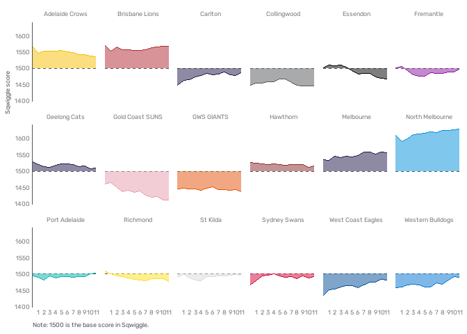

<!-- README.md is generated from README.Rmd. Please edit that file -->

# Sqwiggle

## Introduction

<!-- badges: start -->

<!-- badges: end -->

Sqwiggle is a simple
[ELO](https://cran.r-project.org/web/packages/fitzRoy/vignettes/elo-ratings-example.html)
model for predicting [AFLW](https://www.afl.com.au/aflw) results built
in R using the
[fitzRoy](https://cran.r-project.org/web/packages/fitzRoy/index.html)
and [elo](https://cran.r-project.org/web/packages/elo/index.html)
packages. The name is derived from [Squiggle](https://squiggle.com.au/)

## A better ladder

A key motivation for Sqwiggle was to better understand the state of play
in the AFLW, which is an uneven competition with a compromised fixture.

- As the eighteen teams in the AFLW only play 12 games, whether a team
  is drawn against stronger or weaker opponents will be critical in
  determining the final ladder.

- Similarly, whether the current ladder is reflective of the likely
  finishing positions will depend on whether a team’s draw to date has
  been stronger/weaker than its overall fixture.

We can see this reflected in the table below, which shows data from the
current ladder and a predicted end-of-season ladder based on Sqwiggle.
While both ladders have North Melbourne sitting on top undefeated, other
teams shift position. For example, Geelong, who sit 16th and are
winless, are predicted by Sqwiggle to win six of their remaining nine
games and finish 9th. There current position reflects their opening
three games including matches against North Melbourne and Adelaide (two
of the top three teams based on the current Sqwiggle model) and Sydney
(this year’s biggest improver).

<table class="table" style="color: black; margin-left: auto; margin-right: auto;">

<thead>

<tr>

<th style="text-align:left;">

Team club_name
</th>

<th style="text-align:right;">

Wins current
</th>

<th style="text-align:right;">

Wins predicted
</th>

<th style="text-align:right;">

Position current
</th>

<th style="text-align:right;">

Position predicted
</th>

<th style="text-align:right;">

Position model
</th>

<th style="text-align:right;">

Position change
</th>

</tr>

</thead>

<tbody>

<tr>

<td style="text-align:left;background-color: rgba(136, 219, 223, 255) !important;">

North Melbourne
</td>

<td style="text-align:right;background-color: rgba(136, 219, 223, 255) !important;">

3
</td>

<td style="text-align:right;background-color: rgba(136, 219, 223, 255) !important;">

12
</td>

<td style="text-align:right;background-color: rgba(136, 219, 223, 255) !important;">

1
</td>

<td style="text-align:right;background-color: rgba(136, 219, 223, 255) !important;">

1
</td>

<td style="text-align:right;background-color: rgba(136, 219, 223, 255) !important;">

1
</td>

<td style="text-align:right;background-color: rgba(136, 219, 223, 255) !important;">

0
</td>

</tr>

<tr>

<td style="text-align:left;background-color: rgba(136, 219, 223, 255) !important;">

Melbourne
</td>

<td style="text-align:right;background-color: rgba(136, 219, 223, 255) !important;">

3
</td>

<td style="text-align:right;background-color: rgba(136, 219, 223, 255) !important;">

11
</td>

<td style="text-align:right;background-color: rgba(136, 219, 223, 255) !important;">

2
</td>

<td style="text-align:right;background-color: rgba(136, 219, 223, 255) !important;">

2
</td>

<td style="text-align:right;background-color: rgba(136, 219, 223, 255) !important;">

4
</td>

<td style="text-align:right;background-color: rgba(136, 219, 223, 255) !important;">

0
</td>

</tr>

<tr>

<td style="text-align:left;background-color: rgba(136, 219, 223, 255) !important;">

Adelaide Crows
</td>

<td style="text-align:right;background-color: rgba(136, 219, 223, 255) !important;">

2
</td>

<td style="text-align:right;background-color: rgba(136, 219, 223, 255) !important;">

10
</td>

<td style="text-align:right;background-color: rgba(136, 219, 223, 255) !important;">

6
</td>

<td style="text-align:right;background-color: rgba(136, 219, 223, 255) !important;">

3
</td>

<td style="text-align:right;background-color: rgba(136, 219, 223, 255) !important;">

3
</td>

<td style="text-align:right;background-color: rgba(136, 219, 223, 255) !important;">

3
</td>

</tr>

<tr>

<td style="text-align:left;background-color: rgba(136, 219, 223, 255) !important;">

Hawthorn
</td>

<td style="text-align:right;background-color: rgba(136, 219, 223, 255) !important;">

3
</td>

<td style="text-align:right;background-color: rgba(136, 219, 223, 255) !important;">

9
</td>

<td style="text-align:right;background-color: rgba(136, 219, 223, 255) !important;">

5
</td>

<td style="text-align:right;background-color: rgba(136, 219, 223, 255) !important;">

4
</td>

<td style="text-align:right;background-color: rgba(136, 219, 223, 255) !important;">

5
</td>

<td style="text-align:right;background-color: rgba(136, 219, 223, 255) !important;">

1
</td>

</tr>

<tr>

<td style="text-align:left;background-color: rgba(136, 219, 223, 255) !important;">

Sydney Swans
</td>

<td style="text-align:right;background-color: rgba(136, 219, 223, 255) !important;">

3
</td>

<td style="text-align:right;background-color: rgba(136, 219, 223, 255) !important;">

8
</td>

<td style="text-align:right;background-color: rgba(136, 219, 223, 255) !important;">

3
</td>

<td style="text-align:right;background-color: rgba(136, 219, 223, 255) !important;">

5
</td>

<td style="text-align:right;background-color: rgba(136, 219, 223, 255) !important;">

10
</td>

<td style="text-align:right;background-color: rgba(136, 219, 223, 255) !important;">

-2
</td>

</tr>

<tr>

<td style="text-align:left;background-color: rgba(136, 219, 223, 255) !important;">

Brisbane Lions
</td>

<td style="text-align:right;background-color: rgba(136, 219, 223, 255) !important;">

1
</td>

<td style="text-align:right;background-color: rgba(136, 219, 223, 255) !important;">

8
</td>

<td style="text-align:right;background-color: rgba(136, 219, 223, 255) !important;">

9
</td>

<td style="text-align:right;background-color: rgba(136, 219, 223, 255) !important;">

6
</td>

<td style="text-align:right;background-color: rgba(136, 219, 223, 255) !important;">

2
</td>

<td style="text-align:right;background-color: rgba(136, 219, 223, 255) !important;">

3
</td>

</tr>

<tr>

<td style="text-align:left;background-color: rgba(136, 219, 223, 255) !important;">

Geelong Cats
</td>

<td style="text-align:right;background-color: rgba(136, 219, 223, 255) !important;">

0
</td>

<td style="text-align:right;background-color: rgba(136, 219, 223, 255) !important;">

8
</td>

<td style="text-align:right;background-color: rgba(136, 219, 223, 255) !important;">

16
</td>

<td style="text-align:right;background-color: rgba(136, 219, 223, 255) !important;">

7
</td>

<td style="text-align:right;background-color: rgba(136, 219, 223, 255) !important;">

6
</td>

<td style="text-align:right;background-color: rgba(136, 219, 223, 255) !important;">

9
</td>

</tr>

<tr>

<td style="text-align:left;background-color: rgba(136, 219, 223, 255) !important;">

Essendon
</td>

<td style="text-align:right;background-color: rgba(136, 219, 223, 255) !important;">

3
</td>

<td style="text-align:right;background-color: rgba(136, 219, 223, 255) !important;">

7
</td>

<td style="text-align:right;background-color: rgba(136, 219, 223, 255) !important;">

4
</td>

<td style="text-align:right;background-color: rgba(136, 219, 223, 255) !important;">

8
</td>

<td style="text-align:right;background-color: rgba(136, 219, 223, 255) !important;">

7
</td>

<td style="text-align:right;background-color: rgba(136, 219, 223, 255) !important;">

-4
</td>

</tr>

<tr>

<td style="text-align:left;background-color: rgba(255, 255, 255, 255) !important;">

Carlton
</td>

<td style="text-align:right;background-color: rgba(255, 255, 255, 255) !important;">

2
</td>

<td style="text-align:right;background-color: rgba(255, 255, 255, 255) !important;">

6
</td>

<td style="text-align:right;background-color: rgba(255, 255, 255, 255) !important;">

7
</td>

<td style="text-align:right;background-color: rgba(255, 255, 255, 255) !important;">

9
</td>

<td style="text-align:right;background-color: rgba(255, 255, 255, 255) !important;">

13
</td>

<td style="text-align:right;background-color: rgba(255, 255, 255, 255) !important;">

-2
</td>

</tr>

<tr>

<td style="text-align:left;background-color: rgba(255, 255, 255, 255) !important;">

Port Adelaide
</td>

<td style="text-align:right;background-color: rgba(255, 255, 255, 255) !important;">

1
</td>

<td style="text-align:right;background-color: rgba(255, 255, 255, 255) !important;">

5
</td>

<td style="text-align:right;background-color: rgba(255, 255, 255, 255) !important;">

10
</td>

<td style="text-align:right;background-color: rgba(255, 255, 255, 255) !important;">

10
</td>

<td style="text-align:right;background-color: rgba(255, 255, 255, 255) !important;">

9
</td>

<td style="text-align:right;background-color: rgba(255, 255, 255, 255) !important;">

0
</td>

</tr>

<tr>

<td style="text-align:left;background-color: rgba(255, 255, 255, 255) !important;">

St Kilda
</td>

<td style="text-align:right;background-color: rgba(255, 255, 255, 255) !important;">

1
</td>

<td style="text-align:right;background-color: rgba(255, 255, 255, 255) !important;">

5
</td>

<td style="text-align:right;background-color: rgba(255, 255, 255, 255) !important;">

13
</td>

<td style="text-align:right;background-color: rgba(255, 255, 255, 255) !important;">

11
</td>

<td style="text-align:right;background-color: rgba(255, 255, 255, 255) !important;">

11
</td>

<td style="text-align:right;background-color: rgba(255, 255, 255, 255) !important;">

2
</td>

</tr>

<tr>

<td style="text-align:left;background-color: rgba(255, 255, 255, 255) !important;">

Western Bulldogs
</td>

<td style="text-align:right;background-color: rgba(255, 255, 255, 255) !important;">

1
</td>

<td style="text-align:right;background-color: rgba(255, 255, 255, 255) !important;">

4
</td>

<td style="text-align:right;background-color: rgba(255, 255, 255, 255) !important;">

12
</td>

<td style="text-align:right;background-color: rgba(255, 255, 255, 255) !important;">

12
</td>

<td style="text-align:right;background-color: rgba(255, 255, 255, 255) !important;">

14
</td>

<td style="text-align:right;background-color: rgba(255, 255, 255, 255) !important;">

0
</td>

</tr>

<tr>

<td style="text-align:left;background-color: rgba(255, 255, 255, 255) !important;">

Fremantle
</td>

<td style="text-align:right;background-color: rgba(255, 255, 255, 255) !important;">

1
</td>

<td style="text-align:right;background-color: rgba(255, 255, 255, 255) !important;">

4
</td>

<td style="text-align:right;background-color: rgba(255, 255, 255, 255) !important;">

14
</td>

<td style="text-align:right;background-color: rgba(255, 255, 255, 255) !important;">

13
</td>

<td style="text-align:right;background-color: rgba(255, 255, 255, 255) !important;">

12
</td>

<td style="text-align:right;background-color: rgba(255, 255, 255, 255) !important;">

1
</td>

</tr>

<tr>

<td style="text-align:left;background-color: rgba(255, 255, 255, 255) !important;">

Richmond
</td>

<td style="text-align:right;background-color: rgba(255, 255, 255, 255) !important;">

0
</td>

<td style="text-align:right;background-color: rgba(255, 255, 255, 255) !important;">

4
</td>

<td style="text-align:right;background-color: rgba(255, 255, 255, 255) !important;">

15
</td>

<td style="text-align:right;background-color: rgba(255, 255, 255, 255) !important;">

14
</td>

<td style="text-align:right;background-color: rgba(255, 255, 255, 255) !important;">

8
</td>

<td style="text-align:right;background-color: rgba(255, 255, 255, 255) !important;">

1
</td>

</tr>

<tr>

<td style="text-align:left;background-color: rgba(255, 255, 255, 255) !important;">

West Coast Eagles
</td>

<td style="text-align:right;background-color: rgba(255, 255, 255, 255) !important;">

2
</td>

<td style="text-align:right;background-color: rgba(255, 255, 255, 255) !important;">

3
</td>

<td style="text-align:right;background-color: rgba(255, 255, 255, 255) !important;">

8
</td>

<td style="text-align:right;background-color: rgba(255, 255, 255, 255) !important;">

15
</td>

<td style="text-align:right;background-color: rgba(255, 255, 255, 255) !important;">

16
</td>

<td style="text-align:right;background-color: rgba(255, 255, 255, 255) !important;">

-7
</td>

</tr>

<tr>

<td style="text-align:left;background-color: rgba(255, 255, 255, 255) !important;">

Collingwood
</td>

<td style="text-align:right;background-color: rgba(255, 255, 255, 255) !important;">

1
</td>

<td style="text-align:right;background-color: rgba(255, 255, 255, 255) !important;">

3
</td>

<td style="text-align:right;background-color: rgba(255, 255, 255, 255) !important;">

11
</td>

<td style="text-align:right;background-color: rgba(255, 255, 255, 255) !important;">

16
</td>

<td style="text-align:right;background-color: rgba(255, 255, 255, 255) !important;">

15
</td>

<td style="text-align:right;background-color: rgba(255, 255, 255, 255) !important;">

-5
</td>

</tr>

<tr>

<td style="text-align:left;background-color: rgba(255, 255, 255, 255) !important;">

Gold Coast SUNS
</td>

<td style="text-align:right;background-color: rgba(255, 255, 255, 255) !important;">

0
</td>

<td style="text-align:right;background-color: rgba(255, 255, 255, 255) !important;">

1
</td>

<td style="text-align:right;background-color: rgba(255, 255, 255, 255) !important;">

18
</td>

<td style="text-align:right;background-color: rgba(255, 255, 255, 255) !important;">

17
</td>

<td style="text-align:right;background-color: rgba(255, 255, 255, 255) !important;">

18
</td>

<td style="text-align:right;background-color: rgba(255, 255, 255, 255) !important;">

1
</td>

</tr>

<tr>

<td style="text-align:left;background-color: rgba(255, 255, 255, 255) !important;">

GWS GIANTS
</td>

<td style="text-align:right;background-color: rgba(255, 255, 255, 255) !important;">

0
</td>

<td style="text-align:right;background-color: rgba(255, 255, 255, 255) !important;">

NA
</td>

<td style="text-align:right;background-color: rgba(255, 255, 255, 255) !important;">

17
</td>

<td style="text-align:right;background-color: rgba(255, 255, 255, 255) !important;">

18
</td>

<td style="text-align:right;background-color: rgba(255, 255, 255, 255) !important;">

17
</td>

<td style="text-align:right;background-color: rgba(255, 255, 255, 255) !important;">

-1
</td>

</tr>

</tbody>

</table>

## Team strength

As an ELO model, Sqwiggle’s assessment of teams and predictive ability
is based on past performance. Sqwiggle learns as each round is played.

Sqwiggle’s estimate of each team’s ELO score after each round is shown
below (round zero denotes the team’s end of 2024 score).

<!-- -->

# How well does Sqwiggle go at tipping

Sqwiggle’s tipping performance for 2025 is summarised below. Not bad,
not great.

<table class="table" style="color: black; margin-left: auto; margin-right: auto;">

<thead>

<tr>

<th style="text-align:right;">

Number
</th>

<th style="text-align:right;">

Correct
</th>

<th style="text-align:right;">

Games
</th>

<th style="text-align:right;">

Cumulative
</th>

</tr>

</thead>

<tbody>

<tr>

<td style="text-align:right;">

1
</td>

<td style="text-align:right;">

5
</td>

<td style="text-align:right;">

9
</td>

<td style="text-align:right;">

5
</td>

</tr>

<tr>

<td style="text-align:right;">

2
</td>

<td style="text-align:right;">

8
</td>

<td style="text-align:right;">

9
</td>

<td style="text-align:right;">

13
</td>

</tr>

<tr>

<td style="text-align:right;">

3
</td>

<td style="text-align:right;">

6
</td>

<td style="text-align:right;">

9
</td>

<td style="text-align:right;">

19
</td>

</tr>

</tbody>

</table>

Sqwiggles tips for the next round are below.

<table class="table" style="color: black; margin-left: auto; margin-right: auto;">

<thead>

<tr>

<th style="text-align:right;">

Number
</th>

<th style="text-align:left;">

Home team
</th>

<th style="text-align:left;">

Away team
</th>

<th style="text-align:right;">

Prediction
</th>

<th style="text-align:right;">

Margin predicted
</th>

<th style="text-align:left;">

Tip
</th>

</tr>

</thead>

<tbody>

<tr>

<td style="text-align:right;">

4
</td>

<td style="text-align:left;">

Melbourne
</td>

<td style="text-align:left;">

Richmond
</td>

<td style="text-align:right;">

0.5608436
</td>

<td style="text-align:right;">

6
</td>

<td style="text-align:left;">

Melbourne
</td>

</tr>

<tr>

<td style="text-align:right;">

4
</td>

<td style="text-align:left;">

Gold Coast SUNS
</td>

<td style="text-align:left;">

GWS GIANTS
</td>

<td style="text-align:right;">

0.5025951
</td>

<td style="text-align:right;">

0
</td>

<td style="text-align:left;">

Gold Coast SUNS
</td>

</tr>

<tr>

<td style="text-align:right;">

4
</td>

<td style="text-align:left;">

Carlton
</td>

<td style="text-align:left;">

Western Bulldogs
</td>

<td style="text-align:right;">

0.5103809
</td>

<td style="text-align:right;">

1
</td>

<td style="text-align:left;">

Carlton
</td>

</tr>

<tr>

<td style="text-align:right;">

4
</td>

<td style="text-align:left;">

Hawthorn
</td>

<td style="text-align:left;">

St Kilda
</td>

<td style="text-align:right;">

0.5410931
</td>

<td style="text-align:right;">

4
</td>

<td style="text-align:left;">

Hawthorn
</td>

</tr>

<tr>

<td style="text-align:right;">

4
</td>

<td style="text-align:left;">

Sydney Swans
</td>

<td style="text-align:left;">

Fremantle
</td>

<td style="text-align:right;">

0.5155181
</td>

<td style="text-align:right;">

2
</td>

<td style="text-align:left;">

Sydney Swans
</td>

</tr>

<tr>

<td style="text-align:right;">

4
</td>

<td style="text-align:left;">

Adelaide Crows
</td>

<td style="text-align:left;">

Brisbane Lions
</td>

<td style="text-align:right;">

0.5001880
</td>

<td style="text-align:right;">

0
</td>

<td style="text-align:left;">

Adelaide Crows
</td>

</tr>

<tr>

<td style="text-align:right;">

4
</td>

<td style="text-align:left;">

North Melbourne
</td>

<td style="text-align:left;">

Collingwood
</td>

<td style="text-align:right;">

0.6604832
</td>

<td style="text-align:right;">

16
</td>

<td style="text-align:left;">

North Melbourne
</td>

</tr>

<tr>

<td style="text-align:right;">

4
</td>

<td style="text-align:left;">

Essendon
</td>

<td style="text-align:left;">

Geelong Cats
</td>

<td style="text-align:right;">

0.4998823
</td>

<td style="text-align:right;">

0
</td>

<td style="text-align:left;">

Geelong Cats
</td>

</tr>

<tr>

<td style="text-align:right;">

4
</td>

<td style="text-align:left;">

West Coast Eagles
</td>

<td style="text-align:left;">

Port Adelaide
</td>

<td style="text-align:right;">

0.4644133
</td>

<td style="text-align:right;">

-4
</td>

<td style="text-align:left;">

Port Adelaide
</td>

</tr>

</tbody>

</table>
